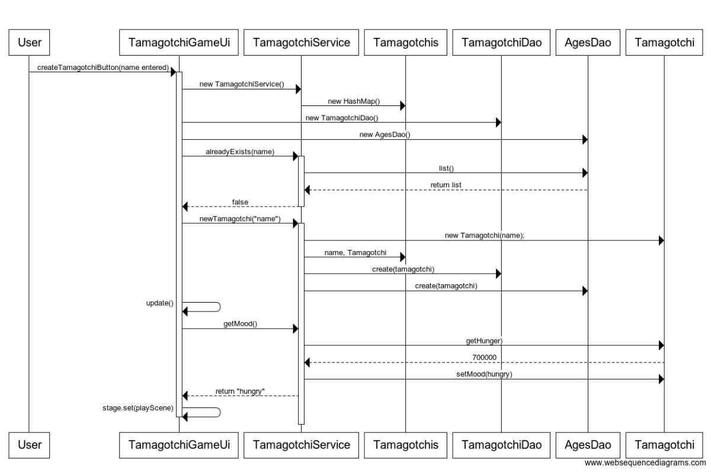

# Arkkitehtuurikuvaus

### Rakenne

Pakkaus ui sisältää javaFX:llä toteutetun käyttöliittymän, pakkaus domain sisältää sovelluslogiikan ja pakkaus dao sisältää tietojen talletuksesta tietokantaan vastaavat luokat

### Sovelluslogiikka 

### Päätoiminnallisuudet

#### Uuden tamagotchin luominen

Kun alkunäkymä on päällä ja käyttäjä on kirjoittanut tekstikenttään uuden tamagotchin nimen, jota ei ole jo olemassa tietokannassa, etenee uuden tamagotchin luominen seuraavasti: 

