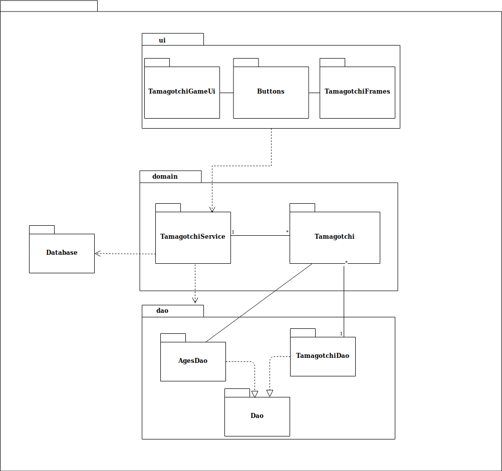
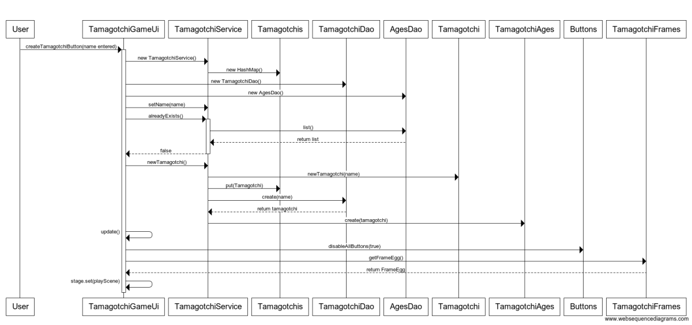
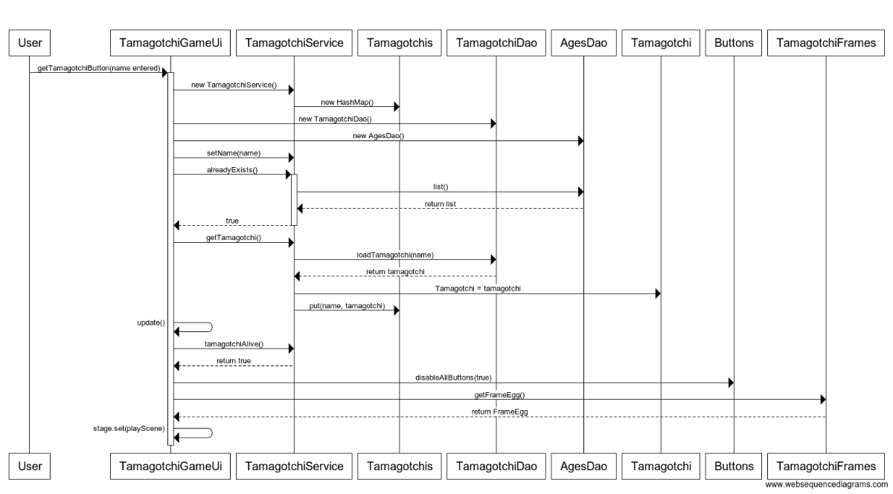
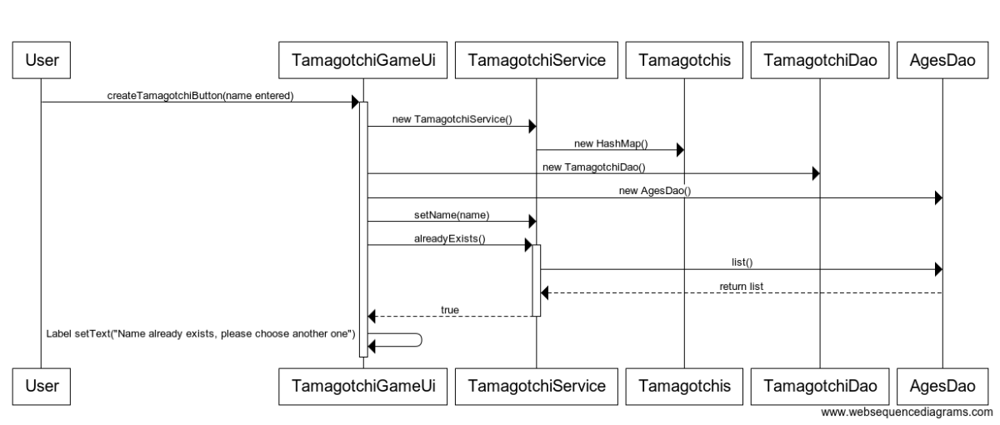
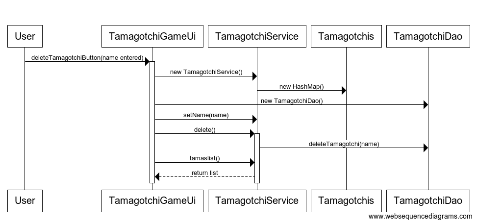

# Arkkitehtuurikuvaus

## Rakenne

Pakkaus [ui](https://github.com/millalin/ot-harjoitustyo/tree/master/TamagotchiGame/src/main/java/ui) sisältää javaFX:llä toteutetun käyttöliittymän, pakkaus [domain](https://github.com/millalin/ot-harjoitustyo/tree/master/TamagotchiGame/src/main/java/domain) sisältää sovelluslogiikan ja pakkaus [dao](https://github.com/millalin/ot-harjoitustyo/tree/master/TamagotchiGame/src/main/java/dao) sisältää tietokannanhallinnasta vastaavat luokat. [Database](https://github.com/millalin/ot-harjoitustyo/tree/master/TamagotchiGame/src/main/java/database) pakkaus sisältää tietokantayhteyden hallinnan. 

## Käyttöliittymä

Käyttöliittymä sisältää neljä erillistä näkymää: 

- alkunäkymä
- pelinäkymä
- kuollut näkymä
- historia ja ikänäkymä

Jokainen näkymistä on toteutettu omana [Scene](https://docs.oracle.com/javase/8/javafx/api/javafx/scene/Scene.html)-oliona. Jokaisesta näkymästä on näkyvänä  yksi kerrallaan sijoitettuna sovelluksen [stageen](https://docs.oracle.com/javase/8/javafx/api/javafx/stage/Stage.html). Graafinen käyttöliittymä on luokassa ui.TamagotchiGameUi. 

Käyttöliittymä on eriytetty sovelluslogiikasta. Käyttöliittymäluokka [TamagotchiGameUi](https://github.com/millalin/ot-harjoitustyo/blob/master/TamagotchiGame/src/main/java/ui/TamagotchiGameUi.java) käyttää [TamagotchiService](https://github.com/millalin/ot-harjoitustyo/blob/master/TamagotchiGame/src/main/java/domain/TamagotchiService.java)-luokan metoden sovelluslogiikan suorittamiseen. 

## Sovelluslogiikka 

Sovelluslogiikan suorittamisesta vastaa TamagotchiService luokka. Dao pakkauksessa olevien luokkien kautta, pääsee TamagotchiService käsiksi tietokannan sisältämiin tietoihin. TamagotchiService tuntee kulloinkin pelissä olevan tamagotchin. 

TamagotchiServicen sekä muiden luokkien ja pakkausten suhdetta kuvaava luokka/pakkauskaavio:

## Tietojen pysyväistallennus

Dao pakkauksen luokat vastaavat tamagotchin tietojen tallentamisesta tietokantaan. Tietokanta käyttää kahta tietokantataulua: Tamagotchi ja TamagotchiAges. Ohjelma luo tietokantataulut alussa, jos niitä ei ole olemassa. Sovellus ottaa tietokantayhdeyden aina kun tamagotchi lisätään, poistetaan tai sitä päivitetään. Ohjelman suoritusaikana tietokantaan päivitetään tamagotchin hoitotoiminnot, ajan kulumisen vaikutus päivitetään ohjelmassa tai kun tamagotchi ladataan ohjelman oltua kiinni. Sovelluksen testeissä käytetään testitietokantaa. Ohjelma käyttää H2 tietokannanhallintajärjestelmää javan [JDBC:n](https://www.oracle.com/technetwork/java/javase/jdbc/index.html) kautta.  Dao luokat noudattavat siis [Data Access Object](https://en.wikipedia.org/wiki/Data_access_object)-suunnittelumallia ja tietokannan toteutustapaa on mahdollista näin ollen helposti vaihtaa ja muokata. 

Sovelluksen juuressa oleva [config.properties](https://github.com/millalin/ot-harjoitustyo/blob/master/TamagotchiGame/config.properties)-tiedosto määrittelee käytettävän tietokannan nimen, joten tätä on helppo muokata ja käyttäjä voi halutessaan valita oletuksesta poikkeavan nimen. 
 
## Päätoiminnallisuudet

### Uuden tamagotchin luominen

Kun alkunäkymä on päällä ja käyttäjä on kirjoittanut tekstikenttään uuden tamagotchin nimen, jota ei ole jo olemassa tietokannassa, etenee uuden tamagotchin luominen seuraavasti: 

Tarkistuksen jälkeen, ettei toista samannimistä tamagotchia ole olemassa ja nimi on sopivan pitkä, tamagotchi lisätään tietokantaan Tamagotchi -tauluun sekä TamagotchiAges -tauluun. Sovellus lisää tamagotchin nimellä haettavaan HashMappiin ja sovellus siirtyy pelinäkymään, jossa aluksi näkyy EggFrame. 

### Vanhan tamagotchin hakeminen

Kun alkunäkymä on päällä ja käyttäjä on kirjoittanut hakukenttään tamagotchin nimen, joka on olemassa jo pelissä etenee sovellus seuraavasti:

Tamagotchi haetaan tietokannasta ja sen tila päivitetään vastaamaan ajan kulumista.

Kun alkunäkymä on päällä ja käyttäjä on kirjoittanut hakukenttään tamagotchin nimen, jota ei ole vielä luotu etenee sovellus seuraavalla tavalla:

### Tamagotchin poistaminen

Kun alkunäkymä on päällä ja käyttäjä on kirjoittanut nimen tekstikenttään ja painaa delete nappulaa, etenee ohjelma seuraavalla tavalla:

Jos poistettavanniminen tamagotchi on tietokannassa, se poistetaan Tamagotchi -tietokantataulusta. TamagotchiAges tietokantatauluun jää kuitenkin tieto tamagotchista ja sen historiasta. 

### Pelin muu toiminta ja toiminnallisuudet

Pelin edetessä, kun ajan myötä tamagotchin tila huononee ja käyttäjä painaa eri hoitonappeja (feed, play, clean, medicate, sleep) päivittyy tamagotchin tila myös tietokantaan niin, että sinne tallentuu tila ja ajanhetki. Toiminnallisuudet toteutuvat tapahtumankäsittelijän kautta, joka kuluttaa aikaa ja päivittää tamagotchin tilaa ja käyttäjän tekemien napin painallusten kautta, joka parantaa kerralla yhden ominaisuuden tilaa ja tallentaa tilanteen tietokantaan. 

## Ohjelman rakenteeseen jääneet heikkoudet

Historianäkymän päivitys ei toimi täydellisesti ja elossaolotieto päivittyy vain, jos tamagotchin tilan käy itse katsomassa pelinäkymässä. Hyvin satunnaisesti (hyvin harvoin) siirryttäessä alkunäkymästä pelinäkymään jäävät napit ilmestymättä näkymään. Tämä ilmeisemminkin johtuu jostakin javaFX:n virheestä. 
