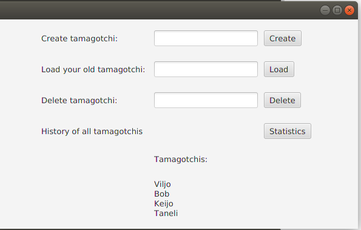
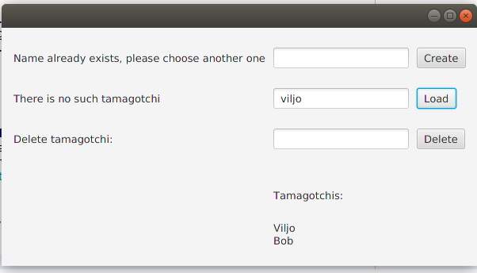
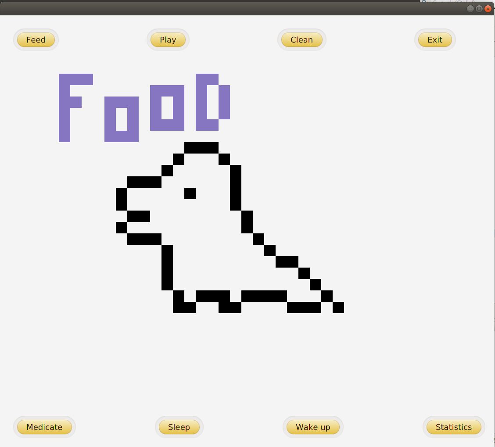
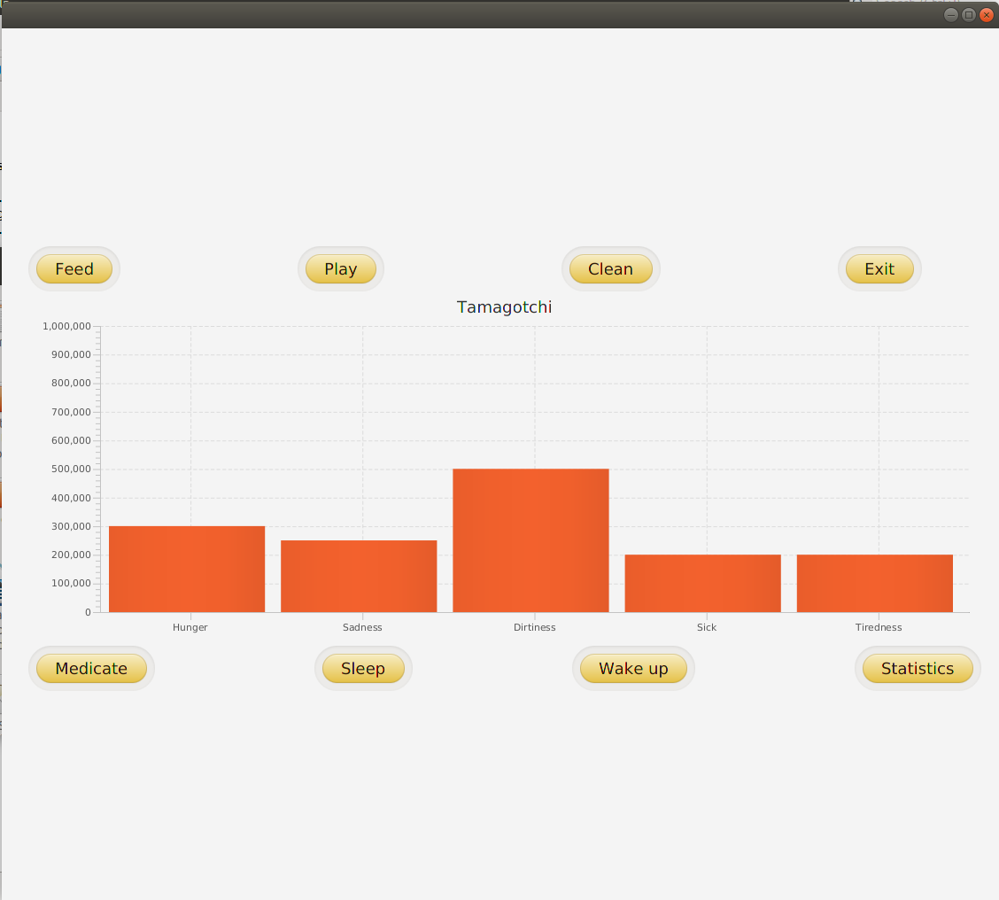
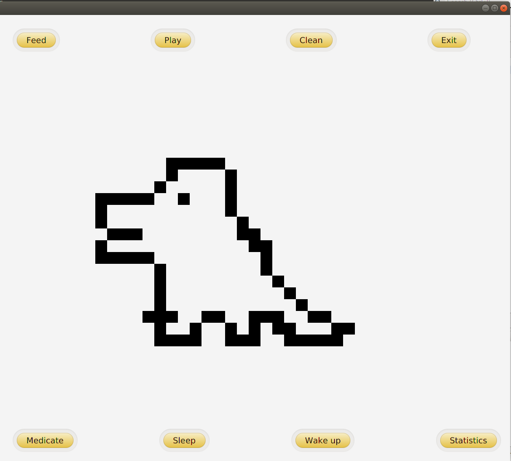

# Käyttöohje

Lataa tiedosto [TamagotchiGame.jar](https://github.com/millalin/ot-harjoitustyo/releases/tag/1.0)

## Konfigurointi

Ohjelma olettaa, että sen sisältävän kansion juuressa on config.properties tiedosto. Se kuitenkin luo tietokannan myös oletusosoitteella, vaikkei tiedostoa ei ole. Tiedostoon voi halutessaan määritellä käytettävän tietokannan osoitepolun ja nimen. Tiedoston oletusmuoto on seuraavanlainen:

    database=./src/main/resources/tamagotchitietokanta

Ohjelmaan voi ladata myös valmiin [config.properties](https://github.com/millalin/ot-harjoitustyo/blob/master/TamagotchiGame/config.properties)-tiedoston. 

## Ohjelman käynnistäminen

Ohjelma käynnistetään komennolla

    java -jar TamagotchiGame.jar

## Alkunäkymä

Sovellus käynnistyy alkunäkymään, jossa voi valita haluaako luoda uuden tamagotchin, ladata ja hakea jo luodun tamagotchin vai poistaa tietokannassa olevan tamagotchin. 

Uuden tamagotchin luominen tapahtuu syöttämällä nimi nimikenttään painamalla create nappia. Nimeä ei saa olla toisella tamagotchilla ja sen tulee olla vähintään 2 merkkiä pitkä. 

Olemassaolevan tamagotchin lataaminen tapahtuu syöttämällä nimi nimikenttään ja painamalla load nappia. Nimi tulee syöttää täysin oikein ja jos tamagotchia ei ole olemassa, ohjelma ilmoittaa siitä. Alkunäkymä myös näyttää alalaidassa kaikki tietokannassa olevat tamagotchit listana. 

Tietokannassa olevan tamagotchin voi poistaa syöttämällä nimen nimikenttään ja painamalla delete nappia. Statistics nappia painamalla pääsee katsomaan tietoja kaikista tamagotcheista, jotka ovat olleet tai ovat edelleen pelissä sekä tarkastamaan jokaisen syntymäpäivän ja iän päivinä. Kun uuden tamagotchin luominen tai vanhan lataaminen onnistuu, siirrytään pelinäkymään. 

Statistics napilla siirrytään historianäkymään.

## Pelinäkymä

Pelinäkymässä on 8 nappia eri toiminnoille ja keskellä näkyy tamagotchi ja sen tila. Kun tamagotchi syntyy se on aluksi muna 30 sekunnin ajan. Tämän jälkeen ruudulle ilmestyy tamagotchivauva. Aluksi sen tila ei ole täydellinen ja sitä pitääkin heti esimerkiksi syöttää.

Feed painikkeella voi syöttää tamagotchia, jolloin sen nälkä vähenee. Play painikkeella voi leikkiä sen kanssa, jolloin sen onnellisuus lisääntyy. Clean painikkeella siivotaan tamagotchin jätökset ja sen likaisuus laskee. Medicate painikkeella voi lääkitä tamagotchin sen ollessa sairas, jolloin sen sairaustila laskee. Sleep painikkeella tamagothcin voi laittaa nukkumaan, jolloin sen energia lisääntyy ja wake up painikkeella tamagotchin voi herättää. Tamagotchin nukkuessa muut napit eivät ole toiminnassa, ennen kuin se herätetään. 

Statistics painikkeesta näkee tamagotchin tämänhetkisen tilan 

Exit painikkeella voi poistua pelinäkymästä ja palata alkunäkymään. 

Jos tamagotchin nälkä, surullisuus, likaisuus tai sairaus ylittävät 1 000 000, tamagotchi menehtyy. Jos tamagotchin väsymystaso ylittää 900 000, tamagotchi nukahtaa automaattisesti, eikä sitä saa hereille ennen kuin sillä on tarpeeksi energiaa. 

Kun hoidat ja hoivaat tamagotchiasi säännöllisesti, siitä kehittyy 4 päivän kuluttua aikuinen. Tämänkin jälkeen tamagotchi toki tarvitsee hoivaa, jotta se selviytyisi.

## Historiatietonäkymä

Historiatietonäkymässä voi tarkastella kaikkien ikinä pelissä olleiden tamagotchien luomispäivää, ikää sekä tietoa elossaolosta. Näkymästä poistutaan exit -napilla. 

## Kuollut näkymä

Jos tamagotchi menehtyy, sitä ei voi enää hoitaa. Näkymästä poistutaan exit -napilla. 
