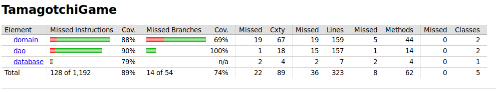

# Testausdokumentti

Ohjelmaa on testattu JUnitin  yksikkö- sekä integraatiotestein ja myös manuaalisilla järjestelmätesteillä. Testeissä ohjelma käyttää erillistä testitietokantaa, jonka tietokantataulut ovat identtisiä varsinaisen tietokannan taulujen kanssa.

## Yksikkö- ja integraatiotestaus

#### Sovelluslogiikka

Testausluokka [TamagotchiServiceTest](https://github.com/millalin/ot-harjoitustyo/blob/master/TamagotchiGame/src/test/java/domain/TamagotchiServiceTest.java) testaa TamagotchiServicen sisältämää sovelluslogiikkaa ja lisäksi Dao-luokkien ja sovelluslogiikan toimivuutta. 
 
#### DAO-luokat

Dao-luokkien testauksessa käytetään hyväksi testeissä luotua testitietokantaa. Dao-luokat testataan yhdessä TamagotchiService luokan kanssa, joka kutsuu niiden metodeja. 

#### Testauskattavuus

Sovelluksen testien rivikattavuus on 89 % ja haaraumakattavuus 74 %. Sovelluksen testikattavuusraportista on jätetty käyttöliittymä pois.Testaamatta jääneet rivit ovat pääosin yksinkertaisia get- ja set-metodeja.

 

## Järjestelmätestaus

Sovelluksen järjestelmätestaus on suoritettu manuaalisesti. 

#### Asennus ja konfigurointi

Sovellus on haettu ja sitä on testattu [käyttöohjeen](https://github.com/millalin/ot-harjoitustyo/blob/master/dokumentaatio/kayttoohje.md) kuvaamalla tavalla Ubuntu 18.04-ympäristössä usealla eri koneella.  

#### Toiminnallisuudet

Kaikki [määrittelydokumentissa](https://github.com/millalin/ot-harjoitustyo/blob/master/dokumentaatio/vaatimusmaarittely.md) ja käyttöohjeessa mainitut toiminnallisuudet on testattu myös siltä osin, että syötteet ovat virheellisiä.  

 

