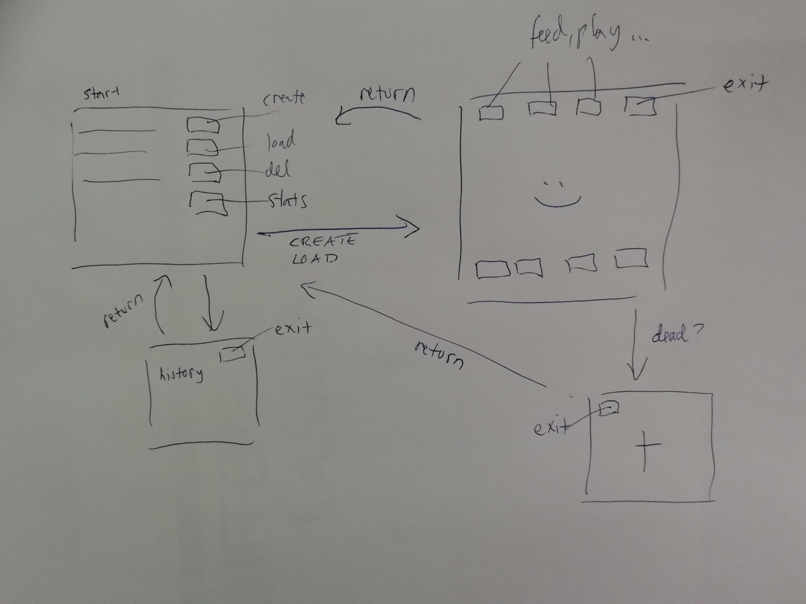

# Tamagotchi vaatimusmäärittely

### Sovelluksen tarkoitus

Tamagotchi on virtuaalilemmikki, joka elää tietokoneen näytöllä. Sitä tulee kuitenkin leikittää, syöttää ja hoivata yhtälailla kuin tavallista lemmikkiä tai se muuttuu surulliseksi, nälkäiseksi tai voi jopa kuolla puutteellisen hoidon seurauksena. Tamagotchipelillä voi virtuaalisesti hoivata ikiomaa lemmikkiä. Sovellukseen on mahdollista luoda eri Tamagotchi eri nimillä. 

### Käyttäjät

Sovelluksella on normaalikäyttäjä, joka on pelin pelaaja. 

### Käyttöliittymäluonnos

### Perusversion tarjoama toiminnallisuus

Mitä toiminnallisuuksia käyttäjän halutaan pystyä tekevän:

Ensimmäisessä näkymässä:
- käyttäjä voi luoda uuden lemmikkitamagotchin ja sille nimen. Nimen tulee olla uniikki ja pituudeltaan vähintään 2 merkkiä ja enintään 25 merkkiä. 
	- jos nimi on liian pitkä tai lyhyt, ohjelma ilmoittaa tästä
- käyttäjä voi syöttää olemassaolevan lemmikin nimen, jolloin sen tila ja näkymä aukeavat näytölle
	- jos syötetyn nimistä tamagothia ei ole olemassa, järjestelmä ilmoittaa tästä
- käyttäjä voi poistaa pelissä olevan taqmagotchin
- käyttäjä voi siirtä historiatietonäkymään, josta näkee nykyiset tamagotchit, sekä tamagotchit, jotka ovat aiemmin olleet pelissä sekä niiden syntymäpäivän ja ikätiedot

Pelinäkymässä:
- luomisen jälkeen näytölle ilmestyy 38 sekunnin ajaksi muna, jonka järkeen siihen ilmestyy vauvavaiheen tamagotchi. 
- pelissä on nappeja, joilla toi tehdä eri toimintoja
- käyttäjä voi syöttää tamagotchia feed napista, jolloin sen nälkä vähenee
- käyttäjä voi leikittää tamagotchia play napista, jolloin sen onnellisuus lisääntyy
- käyttäjä voi siivota tamagochin jätteet clean napista, jolloin sen likaisuus vähenee
- käyttäjä voi lääkitä tamagotchin, jos se on kipeä medicate -napista
- käyttäjä voi laittaa tamagotchin nukkumaan sleep napista ja tällöin tamagotchin energia lisääntyy 1000 yksikköä sekuntia kohden
- käyttäjä voi herättää tamagotchin wake up - napista
- käyttäjä voi poistua alkunäkymään
- käyttäjä voi painaa tilastonäkymää, jolloin tamagotchin nykyinen tila näkyy hetken näytöllä

Jokaisella ominaisuudella on arvo välillä 0-1 000 000 ja jokaiselle ominaisuudelle määritellään, milloin virtuaalilemmikki on missäkin tilassa näiden mukaan. Jos arvo saavuttaa tai ylittää 1 000 000, tamagotchi kuolee. 

Tamagotchin nälkä, väsymys, likaisuus, onnettomuus ja sairaustila lisääntyy ajan kuluessa. Väsymyksen ylittäessä 1 000 000, tamagotchi on pakotettu nukkumaan, kunnes energiaa on riittävästi. muiden ylittyessä tamagothi menehtyy. 

Tamagotchi kehittyy ja kasvaa aikuiseksi neljän päivän kuluessa. 

Myöhäisempiä jatkokehitysideoita:
- tamagotchi voisi oppia taitoja ja sen leikkimahdollisuudet ja ruokavaihtoehdot voisivat lisääntyä ajan kuluessa
- peliin voisi lisätä alkutoiminnallisuuden, jossa vaikeustason voisi valita ja tamagotchi ei kuolisi niin nopeasti

Toimintaympäristön rajoitteet:
- tulee toimia Linux käyttöjärjestelmässä
- tamagotchin tila tallennetaan tietokantaan

